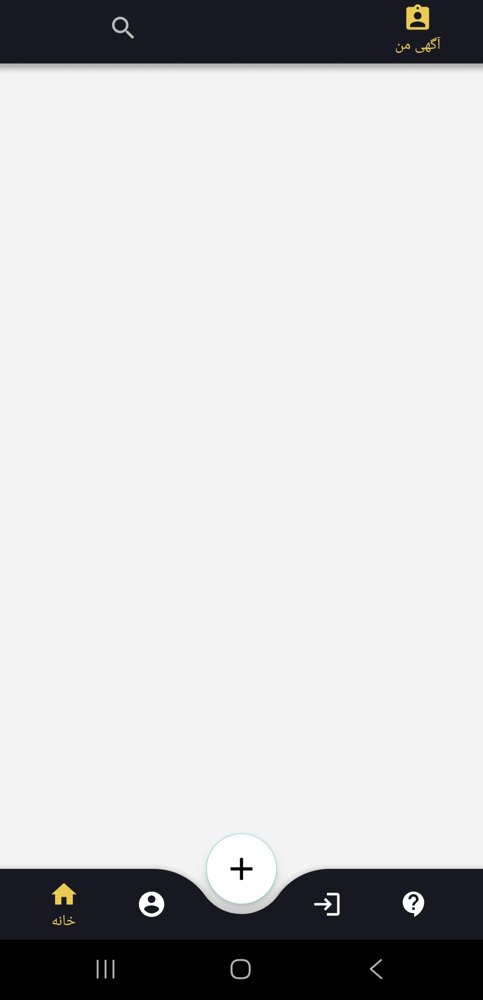
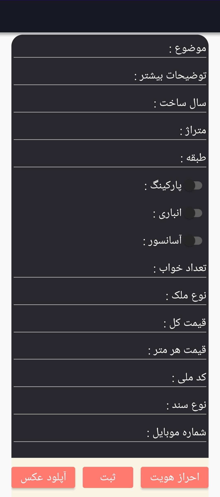
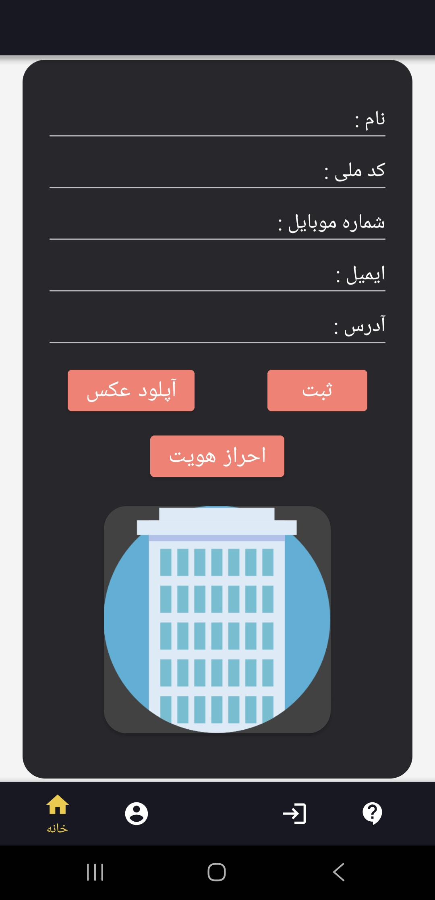

# Real Estate & Navigation Android Project

A professional, high-security Android application developed to showcase advanced software engineering principles, featuring biometric authentication and complex local data management.

## 🌟 Key Technical Features

### 🔐 Advanced Biometric Security
* **Multi-Layer Authentication:** Integrated Android's **Biometric API** (Fingerprint, Face ID, or PIN) not only for user registration but also as a verification step for every advertisement submission.
* **Anti-Fraud Mechanism:** Ensuring that only the verified device owner can post content, preventing unauthorized account usage.

### 🏛️ Architecture & Data Management
* **Database:** Utilizes **SQLite** for robust, offline-first data persistence, managing user profiles and advertisement details seamlessly.
* **Navigation Component:** Implements a modern **Single-Activity Architecture** with Jetpack Navigation for smooth transitions between fragments.
* **Smart Routing:** Conditional navigation logic that automatically detects user status (Guest vs. Registered) to optimize the user flow.

### 🎨 Modern UI/UX Design
* **Custom Navigation:** Features a uniquely styled **Bottom Navigation Bar** with a central Floating Action Button (FAB).
* **Material Design Components:** Uses CardViews, Switches, and custom input fields to provide a professional user experience.
* **Media Integration:** Built-in image picker module for profile pictures and advertisement assets.

## 🛠️ Tech Stack
* **Language:** Java
* **Database:** SQLite
* **UI:** Android Material Design, XML
* **Security:** Android Biometric API

## 📱 App Screenshots

  
  
   
  

